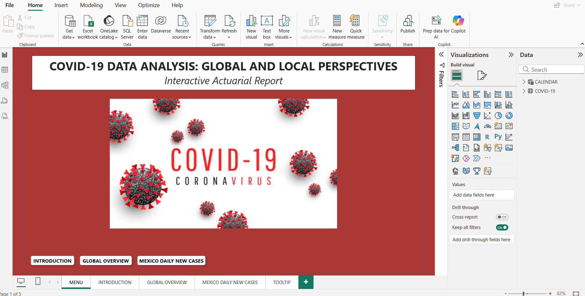
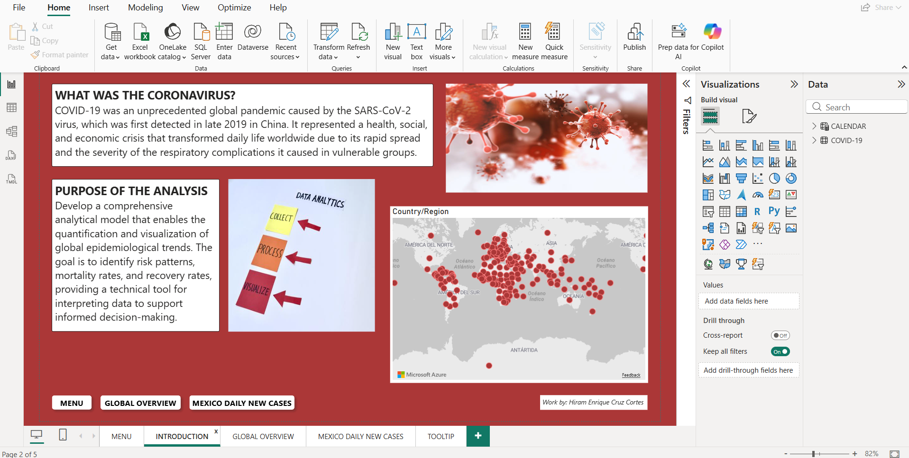
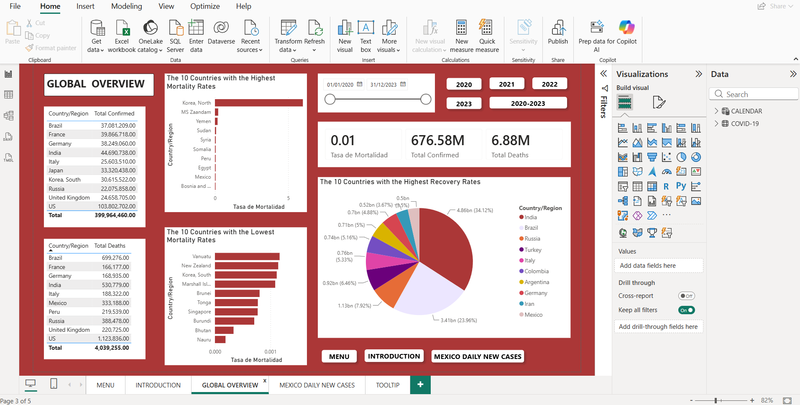
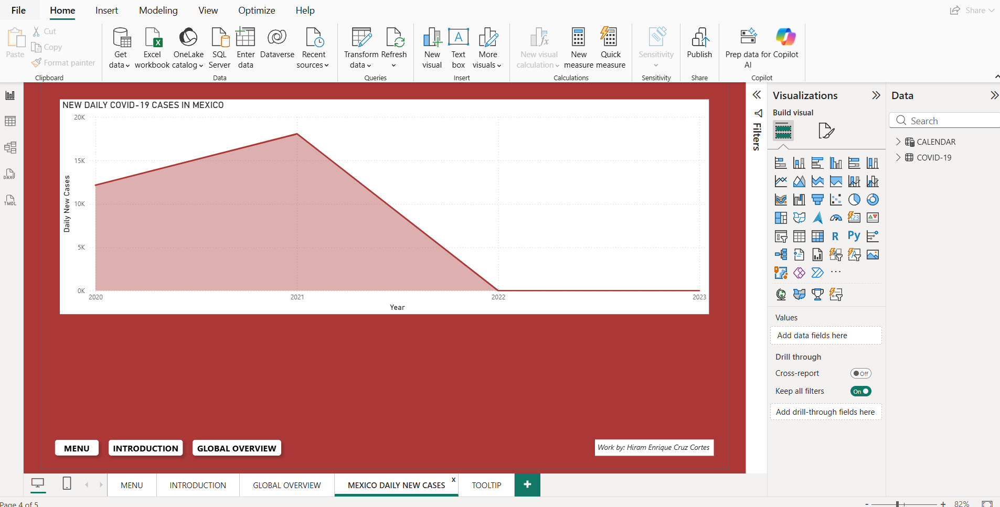
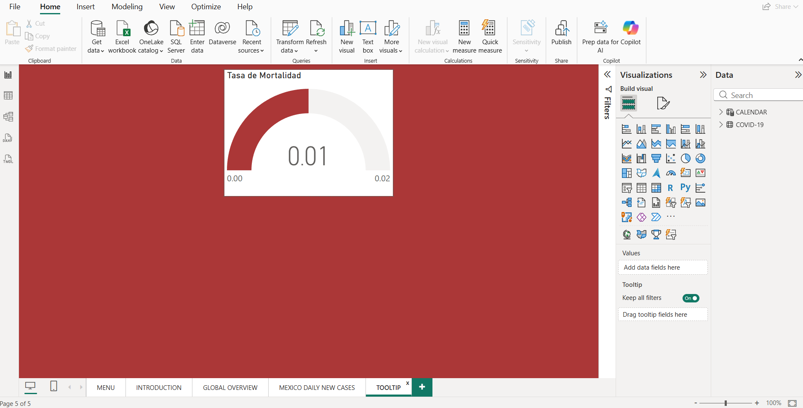

# COVID-19 Data Analysis: Global and Local Perspectives 🦠📊

## 📌 Descripción del Proyecto
Este proyecto consiste en un modelo analítico integral desarrollado en **Power BI**, diseñado para cuantificar y visualizar las tendencias epidemiológicas globales de la pandemia de SARS-CoV-2. 

Con un enfoque de **reporte actuarial interactivo**, el dashboard permite identificar patrones de riesgo, tasas de mortalidad y tasas de recuperación. Sirve como una herramienta técnica para la interpretación de datos masivos, apoyando la toma de decisiones informadas a través del análisis del periodo 2020-2023.

## 🎯 Propósito del Análisis
Desarrollar un flujo de trabajo estructurado de *Data Analytics* (**Collect ➡️ Process ➡️ Visualize**) que transforme datos crudos en métricas epidemiológicas clave, brindando tanto una visión macro (perspectiva global) como una visión micro (casos diarios en México).

## 🗂️ Estructura del Dashboard

El reporte interactivo consta de las siguientes secciones navegables:

1. **Introduction:** Contextualización de la crisis sanitaria, definición del virus y los objetivos técnicos del modelo de datos.
2. **Global Overview:** Panel macro con KPIs y visualizaciones globales.
   - **Métricas principales:** Casos totales confirmados (~676.58M) y decesos totales (~6.88M).
   - **Rankings:** Top 10 países con las tasas de mortalidad más altas y más bajas.
   - **Distribución:** Top 10 países con las tasas de recuperación más altas.
   - **Filtros interactivos:** Segmentación de datos por año (2020, 2021, 2022, 2023).
3. **Mexico Daily New Cases:** Análisis focalizado de la evolución temporal de la pandemia en México, mostrando la curva de nuevos casos diarios a lo largo de los años para identificar picos de contagio.
4. **Tooltips Personalizados:** Indicadores de tipo *Gauge* para visualizar rápidamente la tasa de mortalidad (ej. 0.01) al interactuar con elementos específicos del reporte.

## 🛠️ Herramientas y Tecnologías
* **Microsoft Power BI:** Modelado de datos, creación de relaciones, medidas calculadas y diseño de la interfaz visual (UI).
* **DAX (Data Analysis Expressions):** Creación de métricas clave como *Tasa de Mortalidad*, *Total de Muertes* y *Total de Confirmados*.

## 🚀 Visualizar el reporte

